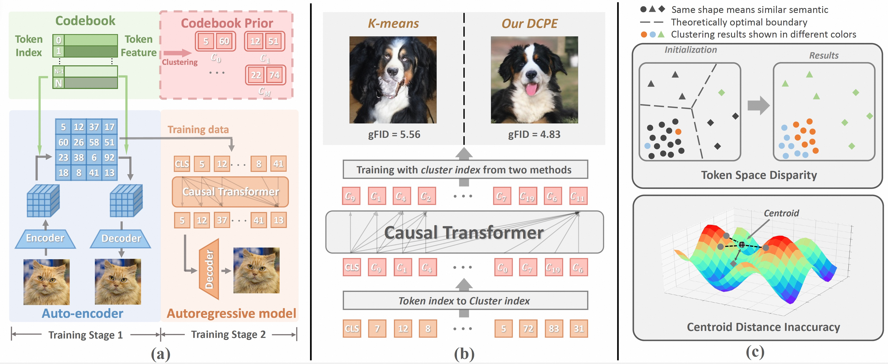

# Exploiting Discriminative Codebook Prior for Autoregressive Image Generation


<div align="center">


[]()&nbsp;
[](https://www.modelscope.cn/models/lloongx/DCPE)&nbsp;

</div>

<p align="center">

<p>


This repo contains pre-trained model weights and training/sampling PyTorch(torch>=2.1.0) codes used in

> [**Exploiting Discriminative Codebook Prior for Autoregressive Image Generation**]()<br>
> Longxiang Tang, Ruihang Chu, Xiang Wang, Yujin Han, Pingyu Wu, Chunming He, Yingya Zhang, Shiwei Zhang, Jiaya Jia
> <br>HKUST, Alibaba Tongyi Lab<br>


## Introduction
In this work, we propose the Discriminative Codebook Prior Extractor (DCPE) as an alternative to k-means clustering for more effectively mining and utilizing the token similarity information embedded in the codebook.
DCPE replaces the commonly used centroid-based distance, which is found to be unsuitable and inaccurate for the token feature space, with a more reasonable instance-based distance. Using an agglomerative merging technique, it further addresses the token space disparity issue by avoiding splitting high-density regions and aggregating low-density ones.

## Getting Started
### Pretrained weights
Download LlamaGen VA-VAE model [vq_ds16_c2i.pt](https://huggingface.co/FoundationVision/LlamaGen/resolve/main/vq_ds16_c2i.pt).
Download pretrained weight of our DCPE at [ModelScope](https://www.modelscope.cn/models/lloongx/DCPE).
Put them into `./pretrained_models`.

### Installation, training and evaluation
See [Getting Started](GETTING_STARTED.md) for detailed instructions.


## License
The majority of this project is licensed under MIT License. Portions of the project are available under separate license of referred projects, detailed in corresponding files.


## BibTeX
```bibtex
Coming soon.
```
